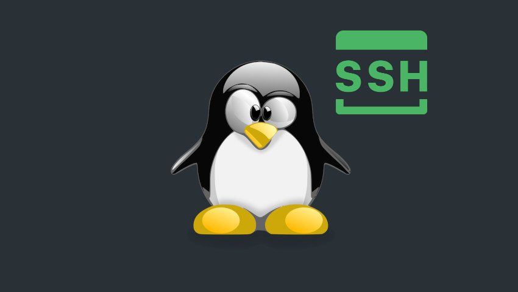
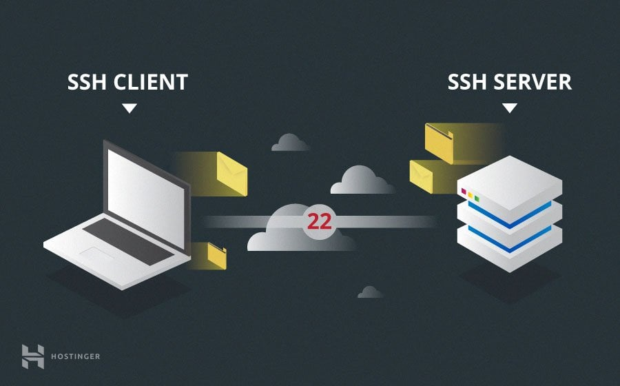

# 0x0B. SSH
## Background Information

Along with this project, you have been attributed an Ubuntu server, living in a datacenter far far away. Like level 2 of the application process,
you will connect using ssh. But contrary to level 2, you will not connect using a password but an RSA key. We’ve configured your server with the
public key you created in the first task of a previous project shared in your intranet profile.

You can access your server information in the my servers section of the intranet, each line with contains the IP and username you should use to
connect via ssh.

Note: Your server is configured with an Ubuntu 20.04 LTS environment.

## General
-  What is a server
-  Where servers usually live
-  What is SSH
-  How to create an SSH RSA key pair
-  How to connect to a remote host using an SSH RSA key pair
-  The advantage of using #!/usr/bin/env bash instead of /bin/bash
-  Allowed editors: vi, vim, emacs
-  All your files will be interpreted on Ubuntu 20.04 LTS
-  All your files should end with a new line
-  A README.md file, at the root of the folder of the project, is mandatory
-  All your Bash script files must be executable
-  The first line of all your Bash scripts should be exactly #!/usr/bin/env bash
-  The second line of all your Bash scripts should be a comment explaining what is the script doing

  
  
  
  
  
  
  
  
  
  

# Tasks
## 0. Use a private key
mandatory

Write a Bash script that uses ssh to connect to your server using the private key ~/.ssh/school with the user ubuntu.

Requirements:
-  Only use ssh single-character flags
-  You cannot use -l
-  You do not need to handle the case of a private key protected by a passphrase

### Tests
-  ./0-use_a_private_key
-  exit

Repo:

    GitHub repository: alx-system_engineering-devops
    Directory: 0x0B-ssh
    File: 0-use_a_private_key
    

## 1. Create an SSH key pair
mandatory

Write a Bash script that creates an RSA key pair.

Requirements:
-  Name of the created private key must be school
-  Number of bits in the created key to be created 4096
-  The created key must be protected by the passphrase betty

### Tests
-  ls
-  ./1-create_ssh_key_pair
-  ls
 
Repo:

    GitHub repository: alx-system_engineering-devops
    Directory: 0x0B-ssh
    File: 1-create_ssh_key_pair
    

## 2. Client configuration file
mandatory

Your machine has an SSH configuration file for the local SSH client, let’s configure it to our needs so that you can connect to a server without typing a password. Share your SSH client configuration in your answer file.

Requirements:
-  Your SSH client configuration must be configured to use the private key ~/.ssh/school
-  Your SSH client configuration must be configured to refuse to authenticate using a password

### Tests
-  ssh -v ubuntu@<server IP>
ssh tries to authenticate using script and does not try to authenticate using a password
-  replace <server IP> with the IP of your server for testing purposes.

Repo:

    GitHub repository: alx-system_engineering-devops
    Directory: 0x0B-ssh
    File: 2-ssh_config
    

## 3. Let me in!
mandatory

Now that you have successfully connected to your server, we would also like to join the party.

Add the SSH public key below to your server so that we can connect using the ubuntu user.

<code>ssh-rsa AAAAB3NzaC1yc2EAAAADAQABAAABAQDNdtrNGtTXe5Tp1EJQop8mOSAuRGLjJ6DW4PqX4wId/Kawz35ESampIqHSOTJmbQ8UlxdJuk0gAXKk3Ncle4safGYqM/VeDK3LN5iAJxf4kcaxNtS3eVxWBE5iF3FbIjOqwxw5Lf5sRa5yXxA8HfWidhbIG5TqKL922hPgsCGABIrXRlfZYeC0FEuPWdr6smOElSVvIXthRWp9cr685KdCI+COxlj1RdVsvIo+zunmLACF9PYdjB2s96Fn0ocD3c5SGLvDOFCyvDojSAOyE70ebIElnskKsDTGwfT4P6jh9OBzTyQEIS2jOaE5RQq4IB4DsMhvbjDSQrP0MdCLgwkN</code>

Repo:

    GitHub repository: alx-system_engineering-devops
    Directory: 0x0B-ssh
    

## 4. Client configuration file (w/ Puppet)
#advanced

Let’s practice using Puppet to make changes to our configuration file. Just as in the previous configuration file task, we’d like you to set up your client SSH configuration file so that you can connect to a server without typing a password.

Requirements:
-  Your SSH client configuration must be configured to use the private key ~/.ssh/school
-  Your SSH client configuration must be configured to refuse to authenticate using a password

### Tests
-  sudo puppet apply 100-puppet_ssh_config.pp

Repo:

    GitHub repository: alx-system_engineering-devops
    Directory: 0x0B-ssh
    File: 100-puppet_ssh_config.pp

  
If you followed the expected instruction, then your SSH connection should work as expected...
  

